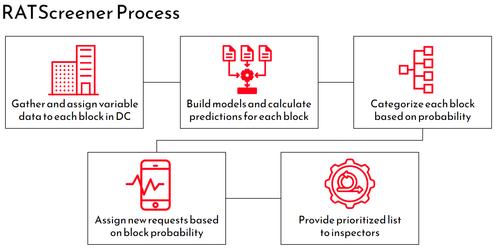
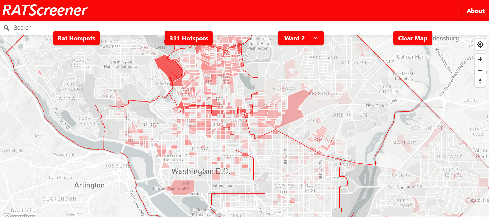

*This project was conducted as part of the University of Pennsylvania’s Master of Urban Spatial Analytics/Smart Cities Practicum in Spring 2023, which was taught by Michael Fichman and Matt Harris. In addition to Michael and Matt, we would like to thank Ren Massari, Peter Casey, and Kevin Wilson of The Lab at DC for their support and guidance on this project.*

**[View RATScreener Web App](https://henryfeinstein.github.io/musa-rats/site/)** | **[View RATScreener Github Repository](https://github.com/henryfeinstein/musa-rats)** | **[Return to MUSA 801 Projects page](https://pennmusa.github.io/MUSA_801.io/)**

```{r message=FALSE, warning=FALSE, include=FALSE}

#setup


# Rmarkdown global setting
knitr::opts_chunk$set(echo = TRUE)
knitr::opts_chunk$set(message = FALSE)
knitr::opts_chunk$set(warning = FALSE)
knitr::opts_chunk$set(cache = TRUE)
knitr::opts_chunk$set(fig.align = 'center')

#----------------------------------------------------------------------------------------------------------  

# Import libraries
library(tidyverse)
library(tidycensus)
library(sf)
library(spdep)
library(caret)
library(ckanr)
library(FNN)
library(grid)
library(gridExtra)
library(ggcorrplot)# plot correlation plot
library(corrplot)
library(corrr)      # another way to plot correlation plot
library(kableExtra)
library(jtools)     # for regression model plots
library(ggstance) # to support jtools plots
library(ggpubr)    # plotting R^2 value on ggplot point scatter
library(broom.mixed) # needed for effects plots
library(knitr)
library(rmarkdown)
library(RSocrata)
library(viridis)
library(ggplot2)
library(stargazer)
library(XML)
library(data.table)
library(ggpmisc)
library(patchwork)
library(spatstat)
library(raster)
library(classInt)   # for KDE and ML risk class intervals
library(tableHTML)
library(exactextractr)
library(sp)
library(units)
library(lubridate)
library(pscl)
library(cvms)
library(yardstick)
library(plotROC)
library(gganimate)
library(gifski)
library(randomForest)
library(caret)
library(e1071) #SVM
library(pscl) # Zero-inflated
library(gbm) #Gradient Boosting
library(rpart) # Decision Tree
library(irr)
library(MLmetrics)
library(riem)
library(rjson)

#----------------------------------------------------------------------------------------------------------  

# Temp
source("https://raw.githubusercontent.com/urbanSpatial/Public-Policy-Analytics-Landing/master/functions.r")
root.dir = "https://github.com/henryfeinstein/musa-rats/blob/main/data/"

bluePalette5 <- c("#eff3ff","#bdd7e7","#6baed6","#3182bd","#08519c")
blue2Palette5 <- c("#08519c","#3182bd","#6baed6","#bdd7e7","#eff3ff")
H_bluePalette5 <- c("#eff3ff","#bdd7e7","#6baed6","#3182bd","#252525")
orangePalette5 <- c("#FFF2E8","#FFD6B6","#FEB984","#FE9D51","#FD801F")
orange2Palette5 <- c("#FFDFD0","#FFB89F","#FF926E","#FF6B3D","#FF440C")
greyPalette5 <- c("#f7f7f7","#cccccc","#969696","#636363","#252525")
greenPalette5 <- c("#edf8e9","#bae4b3","#74c476","#31a354","#006d2c")
purplePalette5 <- c("#f2f0f7","#cbc9e2","#9e9ac8","#756bb1","#54278f")

redPalette3 <- c("#808080", "#E99191", "#E91C1C")

# Etc
options(scipen=999)
options(tigris_class = "sf")

#----------------------------------------------------------------------------------------------------------  

# functions

st_c    <- st_coordinates
st_coid <- st_centroid

plotTheme <- theme(
  plot.title =element_text(size=12),
  plot.subtitle = element_text(size=8),
  plot.caption = element_text(size = 6),
  axis.text.x = element_text(size = 10, angle = 45, hjust = 1),
  axis.text.y = element_text(size = 10),
  axis.title.y = element_text(size = 10),
  # Set the entire chart region to blank
  panel.background=element_blank(),
  plot.background=element_blank(),
  #panel.border=element_rect(colour="#F0F0F0"),
  # Format the grid
  panel.grid.major=element_line(colour="#D0D0D0",size=.2),
  axis.ticks=element_blank())

mapThememin <- function(base_size = 10, title_size = 12, small_size = 8) {
  theme(
    text = element_text( color = "black"),
    plot.title = element_text(size = title_size, colour = "black", hjust = 0.5),
    plot.subtitle=element_text(size = base_size, colour = "black", hjust = 0.5, face="italic"),
    plot.caption=element_text(size = small_size, colour = "black", hjust = 0.5),
    axis.ticks = element_blank(),
    axis.title = element_blank(),
    axis.text = element_blank(),
    axis.title.x = element_blank(),
    axis.title.y = element_blank(),
    panel.background = element_blank(),
    panel.grid.minor = element_blank(),
    panel.border = element_blank(),
    strip.text.x = element_text(size = small_size, face="italic"),
    strip.text.y = element_text(size = small_size, face="italic"),
    strip.background = element_rect(colour="transparent", fill="transparent"),
    legend.title = element_text(size = small_size),
    legend.text = element_text(size = small_size),
    legend.key.size = unit(0.4, "cm"))
}

mapThememin2 <- function(base_size = 8, title_size = 10, small_size = 6) {
  theme(
    text = element_text( color = "black"),
    plot.title = element_text(size = title_size, colour = "black", hjust = 0.5),
    plot.subtitle=element_text(size = base_size, colour = "black", hjust = 0.5, face="italic"),
    plot.caption=element_text(size = small_size, colour = "black", hjust = 0.5),
    axis.ticks = element_blank(),
    axis.title = element_blank(),
    axis.text = element_blank(),
    axis.title.x = element_blank(),
    axis.title.y = element_blank(),
    panel.background = element_blank(),
    panel.grid.minor = element_blank(),
    panel.border = element_blank(),
    strip.text.x = element_text(size = base_size),
    strip.text.y = element_text(size = base_size),
    strip.background = element_rect(colour="transparent", fill="transparent"),
    legend.title = element_text(size = small_size),
    legend.text = element_text(size = small_size),
    legend.key.size = unit(0.25, "cm"))
}


corTheme <- function(base_size = 10, title_size = 12, small_size = 8){
  theme(axis.text =  element_blank(), 
        axis.ticks = element_blank(), 
        text = element_text(size = 10),
        panel.background = element_rect(fill = greyPalette5[1]),
        axis.title.x = element_text(size = small_size),
        axis.title.y = element_text(size = small_size),
        plot.subtitle = element_text(hjust = 0.5, size = base_size),
        plot.title = element_text(hjust = 0.5, size = title_size),
        plot.caption=element_text(size = small_size, colour = "black", hjust = 0.5),
        strip.background = element_rect(colour="transparent", fill="transparent"))
}


corTheme2 <- function(base_size = 10, title_size = 12, small_size = 8){
  theme(axis.text =  element_text(size = small_size),
        text = element_text(size = 10),
        panel.background = element_rect(fill = greyPalette5[1]),
        axis.title.x = element_text(size = small_size),
        axis.title.y = element_text(size = small_size),
        plot.subtitle = element_text(hjust = 0.5, size = base_size,  face="italic"),
        plot.title = element_text(hjust = 0.5, size = title_size),
        plot.caption=element_text(size = small_size, colour = "black", hjust = 0.5),
        strip.background = element_rect(colour="transparent", fill="transparent"),
        strip.text.x = element_text(size = small_size, face="italic"),
        strip.text.y = element_text(size = small_size, face="italic"))
}

corTheme3 <- function(base_size = 9, title_size = 11, small_size = 7){
  theme(axis.text =  element_text(size = small_size),
        text = element_text(size = 10),
        panel.background = element_rect(fill = greyPalette5[1]),
        axis.title.x = element_text(size = small_size),
        axis.title.y = element_text(size = small_size),
        plot.subtitle = element_text(hjust = 0.5, size = base_size,  face="italic"),
        plot.title = element_text(hjust = 0.5, size = title_size),
        plot.caption=element_text(size = small_size, colour = "black", hjust = 0.5))
}

corTheme4 <- function(base_size = 9, title_size = 11, small_size = 7){
  theme(axis.text =  element_text(size = small_size),
        text = element_text(size = 10),
        panel.background = element_rect(fill = greyPalette5[1]),
        axis.title.x = element_text(size = small_size),
        axis.title.y.right = element_text(size = small_size),
        plot.subtitle = element_text(hjust = 0.5, size = base_size,  face="italic"),
        plot.title = element_text(hjust = 0.5, size = title_size),
        plot.caption=element_text(size = small_size, colour = "black", hjust = 0.5))
}


q5 <- function(variable) {as.factor(ntile(variable, 5))}

q <- function(variable) {as.factor(ntile(variable, 5))}

qBr <- function(df, variable, rnd) {
  if (missing(rnd)) {
    as.character(quantile(round(df[[variable]],0),
                          c(.01,.2,.4,.6,.8), na.rm=T))
  } else if (rnd == FALSE | rnd == F) {
    as.character(formatC(quantile(df[[variable]],
                                  c(.01,.2,.4,.6,.8), na.rm=T),
                         digits = 3))
  }
}

qBr2 <- function(df, variable, rnd) {
  if (missing(rnd)) {
    as.character(quantile(round(df[[variable]]*100,0)/100,
                          c(.01,.2,.4,.6,.8), na.rm=T))
  } else if (rnd == FALSE | rnd == F) {
    as.character(formatC(quantile(df[[variable]],
                                  c(.01,.2,.4,.6,.8), na.rm=T),
                         digits = 3))
  }
}

qBr3 <- function(df, variable, rnd) {
  if (missing(rnd)) {
    as.character(round(quantile(round(df[[variable]]*1000000,0),
                          c(.01,.2,.4,.6,.8), na.rm=T)),0)
  } else if (rnd == FALSE | rnd == F) {
    as.character(formatC(quantile(df[[variable]],
                                  c(.01,.2,.4,.6,.8), na.rm=T),
                         digits = 3))
  }
}

substrRight <- function(x, n){
  substr(x, nchar(x)-n+1, nchar(x))
}


nn_function <- function(measureFrom,measureTo,k) {
  measureFrom_Matrix <- as.matrix(measureFrom)
  measureTo_Matrix <- as.matrix(measureTo)
  nn <- get.knnx(measureTo, measureFrom, k)$nn.dist
  output <- as.data.frame(nn) %>%
    rownames_to_column(var = "thisPoint") %>%
    gather(points, point_distance, V1:ncol(.)) %>%
    arrange(as.numeric(thisPoint)) %>%
    group_by(thisPoint) %>%
    summarize(pointDistance = mean(point_distance)) %>%
    arrange(as.numeric(thisPoint)) %>% 
    dplyr::select(-thisPoint) %>%
    pull()
  return(output)  
}


myCrossValidate <- function(dataset, id, dependentVariable, indVariables) {
  
  allPredictions <- data.frame()
  cvID_list <- unique(dataset[[id]])
  
  for (i in cvID_list) {
    
    thisFold <- i
    cat("This hold out fold is", thisFold, "\n")
    
    fold.train <- filter(dataset, dataset[[id]] != thisFold) %>% as.data.frame() %>% 
      dplyr::select(id, geometry, indVariables, dependentVariable)
    fold.test  <- filter(dataset, dataset[[id]] == thisFold) %>% as.data.frame() %>% 
      dplyr::select(id, geometry, indVariables, dependentVariable)
    
    regression <-
      glm(countMVTheft ~ ., family = "poisson", 
          data = fold.train %>% 
            dplyr::select(-geometry, -id))
    
    thisPrediction <- 
      mutate(fold.test, Prediction = predict(regression, fold.test, type = "response"))
    
    allPredictions <-
      rbind(allPredictions, thisPrediction)
    
  }
  return(st_sf(allPredictions))
}

#----------------------------------------------------------------------------------------------------------  

#----------------------------------------------------------------------------------------------------------  

# LoadAPI
census_api_key("4bbe4bead4e5817f6a6b79e62c5bea69e77f1887", overwrite = TRUE)


```
## Abstract

Rats thrive in cities. However, the feeling is not mutual according to city residents. In 2021, DC’s 311 Service received over 11,000 requests for rodent inspection and abatement. As inspection requests continue to increase after a pandemic-induced spike in rat populations, inspection departments are inundated with requests for treatment [1]. However, inspection and treatment require resources: personnel, time, and money. With over half of the inspection requests in DC not finding evidence of rats, the inspection and treatment process is costly to the city.

This project explores the spatial and time patterns related to vermin infestation in order to develop a predictive model for estimating the probability of rat detection in a given area of Washington, DC. The information provided by the tool will allow city health and vermin inspectors to prioritize exterior inspections of properties suspected of vermin infestation based on the actual likelihood of rodents being detected. We aim to create a proof-of-concept infestation forecast that will be used as the basis of an inspection optimization data system and web app, which will allow for more targeted and efficient inspections.

## 1. Introduction: Context & Use Case

Municipal rodent management is a critical part of local government operations. In many cities, rodent infestation is persistent and can have detrimental impacts on the public infrastructure, local economy, overall health and well-being of both residents and the environment [2]. Cities face the monumental challenge of conducting large-scale rodent management, responding to resident complaints, and educating the public on the cause of rodent infestations. 

This project aims to develop a screening tool that prioritizes DC 311 requests for rodent inspection based on the likelihood of rat detection on a given block. The goal of this work is to more effectively distribute resources used for inspection and treatment with the hopes of freeing up resources for other rodent management needs. The ultimate goal is to aid in the abatement of DC’s rat infestation issues. 

### 1.1: Understanding Urban Vermin Infestations

Norway rats, also known as brown rats, are the most common species found in U.S. cities. These rats are commonly associated with sanitation problems in cities. While this reputation is accurate, rats are also behind many other problems that occur in urban areas. Rodents can cause structural issues by burrowing in streets or buildings, causing property damage that can result in the loss of businesses and homes. Rats also cause power outages, internet blackouts, and fires by gnawing on gas lines or electrical wires. Finally, they also pose a risk to public health and well-being as they can contaminate food, carry diseases, and spread pathogens [1].

Cities, with their large and dense human populations, provide optimal habitats for rats. Colonies of rats can stretch across entire city blocks. Rats utilize human-made infrastructure by traveling via sewer systems or utility lines to reach neighboring buildings. Food is the most important resource that cities provide to rats. They often explore their territories for new food sources at night when there is less human activity. City residents know that residential and commercial trash cans and dumpsters are often not tightly secured, making them prime opportunities for rats to find food. Ultimately, human behaviors and food waste are a main driving force behind urban rat infestations [3]. 

### 1.2: DC's Current Rat Infestation Abatement Approach

The Distric of Columbia Department of Health (DC Health) is responsible for the city’s rodent control program. Currently, DC Health aims to protect public health by reducing rodent activity through a combination of proactive surveys, inspections, baiting, enforcement, community outreach and distribution of educational materials. This work is performed by the Rodent and Vector Control Division, but relies on interagency cooperation. 

DC’s business-as-usual approach relies on professional knowledge and ad-hoc decision-making on a daily basis. Residents can request inspections from DC Health and the Rodent and Vector Control Division by submitting reports through 311. When a request is received, DC Health inspectors are sent to the location of the call to inspect and treat any infestations. However, there are more inspection requests than inspectors can handle on a daily basis.  There is currently no formal prioritization of inspection requests.This strategy allows for inefficiencies in terms of employee time and financial resources, limiting the benefits of the inspection services  to the public. 

### 1.3: Our Approach to Improving Rat Inspection Efficiency

Our project aims to disrupt the current inefficiencies in inspection services by developing an inspection optimization system, called RATScreener. The RATScreener system will be based on a predictive model that forecasts the likelihood of infestation based on a range of spatial, population, and built environment variables. This system will assign probabilities of infestation to specific blocks and provide an overview of hotspot areas in DC. 

This approach will allow the inspection office to prioritize incoming requests and understand the probability of actual infestations. DC Health inspectors can then make more informed decisions, target inspections to areas of high infestation probability, and reduce strain on limited resources within the department. 

### 1.4: RATScreener Overview 
We present an overview of the modeling process behind RATScreener below. Our process began by collecting data and assigning variables to each block in DC. We then run our model and calculate predictions for each block, which are then categorized by priority based on the probability of rat detection. As new requests come in, RATScreener identifies the block in which the address is located and assigns a priority level based on the block’s risk of rat detection. Finally, a list of prioritized requests is presented to inspectors via the RATScreener app. 



## 2. Exploratory Analysis

In the exploratory analysis phase of this project, we aim to identify the patterns of rat infestation across time and space. Our analysis attempts to understand the spatial process associated with infestation and the relationships between built environment, spatial, and population variables.

### 2.1: Processing Rat Inspection Outcomes as the Dependent Variable

The primary independent variable that the RATScreener model is trying to predict is whether a given 311 request for a rat inspection will lead to the discovery and treatment of an actual infestation. DC Health provided a dataset of all rat inspection requests placed through DC’s 311 Service between 2015 and 2018. The dataset includes the address the request was placed at, administrative information, and field notes from the resulting inspection. 

A text analysis was performed on the field notes to assign each 311 request to a “rats found/no rats found” binary variable. The analysis detected words such as “baited,” “treatment,” and “treated” to indicate that rat activity was identified, and phrases such as “no evidence,” “no rat burrows,” or “no rat activity” as indications that no evidence of rats was found. The resulting binary variable is used as the independent variable for the remainder of the analysis. 

As previously mentioned, rat colonies tend to be limited by barriers in the built environment such as roads and other impervious surfaces. Because of this, rat inspections typically cover an entire block, not just the address that the 311 request came from. In order to have the modeling process reflect this approach to treatment, the RATScreener tool predicts the likelihood of rat infestation at the city block level. After creating city block polygons using DC Open Data's [Street Centerlines shapefile](https://opendata.dc.gov/datasets/DCGIS::street-centerlines-2013/explore?location=38.894921%2C-77.025952%2C12.88), the binary variable described above was translated to a block-level binary variable of whether rats had been found anywhere on that block in the past. This process yielded 5,243 city blocks in DC which are used for the remainder of the analysis. 

In addition to the 311 data shown above, DC Health provided us with a dataset of 100 inspections performed across the city at locations which were not connected to a 311 request. This secondary dataset is used later in the analysis for additional validation and to better understand how reliant the models are on patterns seen in 311 data specifically, rather than the underlying data of actual rat infestation. 

### 2.2: Exploring Risk of Rat Infestation

```{r message=FALSE, warning=FALSE, out.width = '100%', results='hide', fig.keep='all'}
# Load rat infestation dataset and spatialize
Rats <- read.csv("./data/rats_to_blocks.csv.gz", header = TRUE) %>%
  na.omit() %>%
  st_as_sf(.,coords=c("LONGITUDE","LATITUDE"),crs=4326) %>%
  st_transform('ESRI:102685') %>%
  mutate(month = month(ymd_hms(SERVICEORDERDATE)),
         year = year(ymd_hms(SERVICEORDERDATE)),
         serviceday = ymd(substr(SERVICEORDERDATE,1,10))) %>%
  dplyr::select(P0010001, index_right, SERVICEORDERDATE, INSPECTIONDATE, SERVICENOTES, serviceday, WARD, week, year, month, calls, activity, geometry)

# load street centerlines from DC open data
centerlines <- st_read("./data/Street_Centerlines_2013/Street_Centerlines_2013.geojson") %>% 
  st_transform("ESRI:102685") %>% 
  filter(ROADTYPE == "Street")

# convert street centerlines to block polygons
blocks <- as.data.frame(st_collection_extract(st_polygonize(st_union(centerlines)))) %>% 
  dplyr::mutate(block_id = row_number()) %>% 
  st_as_sf()
boundary <- st_union(blocks)

# spatial join to assign each rat datapoint to a block polygon
rats_block_join <- st_join(Rats, blocks)

# count observations per block for mapping
block_dat <- left_join(blocks, rats_block_join %>% 
                                          st_drop_geometry() %>% 
                                          group_by(block_id) %>% 
                                          dplyr::summarize(inspection_count = n(),
                                                    rats_found_yn = ifelse(1 %in% activity, 1, 0),
                                                    rats_found_count = sum(activity))) %>% 
  dplyr::mutate(inspection_count = replace_na(inspection_count, 0),
         rats_found_yn = replace_na(rats_found_yn, 0),
         rats_found_count = replace_na(rats_found_count, 0),
         area_acres = as.numeric(st_area(.)) / 43560) %>%
 dplyr::mutate(found = case_when(rats_found_yn == "0" ~ "not_found",
                            rats_found_yn == "1" ~ "found"))

# count of inspections map
count_inspections <- ggplot() + geom_sf(data = block_dat, aes(fill = inspection_count), color = "transparent") +
  scale_fill_gradient(low = "#e3b1b1", high = "#E91C1C", name = "Count") +
  labs(title = "Count of Inspections by Block",
       subtitle = "",
       caption = "") +
  mapThememin2()

# count of rats found per block map
count_rats <- ggplot() + geom_sf(data = block_dat, aes(fill = rats_found_count), color = "transparent") +
  scale_fill_gradient(low = "#e3b1b1", high = "#E91C1C", name = "Count") +
  labs(title = "Number of Rat Detection Instances by Block",
       subtitle = "",
       caption = "") +
  mapThememin2()

# any rats found y/n per block map
rats_yn <- ggplot() +
  geom_sf(data = block_dat, aes(fill = found), color = "transparent") +
  scale_fill_manual(values = c("not_found" = "#e3b1b1", "found" = "#E91C1C"), name = "Outcome") +
  labs(title = "Blocks by Binary Found/Not Found Variable",
       subtitle = "",
       caption = "") +
  mapThememin2()

# rat ID rate per block map
rat_id <- ggplot() + geom_sf(data = block_dat, aes(fill = rats_found_count / inspection_count), color = "transparent") +
  scale_fill_gradient(low = "#e3b1b1", high = "#E91C1C", name = "Detection Rate") +
  labs(title = "Rat ID Rate (Count of Rats Found / Number of Inspections) \nby Block",
       subtitle = "",
       caption = "") +
  mapThememin2()

grid.arrange(count_inspections, count_rats, rats_yn, rat_id, ncol = 2)
```

When viewing the distribution of 311 inspection requests and the outcomes of those requests, a clear pattern emerges. As the maps above show, inspections requests and rat infestations in 311 data are heavily concentrated in the center of DC, which is also the densest part of the city. This pattern is unsurprising given that human density drives rat population increase through the increased presence of food and garbage. One particularly variable to examine is what we call here the "Rat ID Rate," which gives the percentage of all 311 inspection requests that actually result in evidence of rats being identified for a given block. The patterns in Rat ID Rate generally follow the overall patterns in where rats are being seen, suggesting that 311 calls are in fact responding at least to some extent to the reality of rat distribution throughout the city.

### 2.3: Independent Variables

```{r load and join indepdent vars, cache = TRUE, message=FALSE, warning=FALSE, out.width = '100%', results='hide', fig.keep='all'}
Data311 <-
  rbind(st_read("./data/311_City_Service_Requests_in_2015.geojson") %>%
  st_transform('ESRI:102685') %>%
  filter(SERVICECODEDESCRIPTION == "Alley Cleaning" | SERVICECODEDESCRIPTION == "Curb and Gutter Repair" | SERVICECODEDESCRIPTION == "DOEE - Nuisance Odor Complaints" | SERVICECODEDESCRIPTION == "DOEE - General Environmental Concerns" | SERVICECODEDESCRIPTION == "Dead Animal Collection" | SERVICECODEDESCRIPTION == "Illegal Dumping" | SERVICECODEDESCRIPTION == "Pothole" | SERVICECODEDESCRIPTION == "Sanitation Enforcement" | SERVICECODEDESCRIPTION == "Street Cleaning" | SERVICECODEDESCRIPTION == "Trash Collection - Missed" | SERVICECODEDESCRIPTION == "Yard Waste - Missed") %>%
  dplyr::select(SERVICECODEDESCRIPTION, SERVICEORDERDATE, INSPECTIONDATE, LATITUDE, LONGITUDE, WARD) %>%
  mutate(TYPE = case_when(SERVICECODEDESCRIPTION == "Alley Cleaning" ~ "Trash_issues",
                          SERVICECODEDESCRIPTION == "DOEE - Nuisance Odor Complaints" ~ "Trash_issues",
                          SERVICECODEDESCRIPTION == "DOEE - General Environmental Concerns" ~ "Trash_issues",
                          SERVICECODEDESCRIPTION == "Dead Animal Collection" ~ "Trash_issues",
                          SERVICECODEDESCRIPTION == "Illegal Dumping" ~ "Trash_issues",
                          SERVICECODEDESCRIPTION == "Sanitation Enforcement" ~ "Trash_issues",
                          SERVICECODEDESCRIPTION == "Street Cleaning" ~ "Trash_issues",
                          SERVICECODEDESCRIPTION == "Trash Collection - Missed" ~ "Trash_issues",
                          SERVICECODEDESCRIPTION == "Yard Waste - Missed" ~ "Trash_issues",
                          SERVICECODEDESCRIPTION == "Curb and Gutter Repair" ~ "Infrastructure_issues",
                          SERVICECODEDESCRIPTION == "Pothole" ~ "Infrastructure_issues",
                          ),
         month = month(ymd_hms(SERVICEORDERDATE)),
         serviceday = ymd(substr(SERVICEORDERDATE,1,10))
         ) %>%
  filter(month >= 8),
  st_read("./data/311_City_Service_Requests_in_2016.geojson") %>%
  st_transform('ESRI:102685') %>%
  filter(SERVICECODEDESCRIPTION == "Alley Cleaning" | SERVICECODEDESCRIPTION == "Curb and Gutter Repair" | SERVICECODEDESCRIPTION == "DOEE - Nuisance Odor Complaints" | SERVICECODEDESCRIPTION == "DOEE - General Environmental Concerns" | SERVICECODEDESCRIPTION == "Dead Animal Collection" | SERVICECODEDESCRIPTION == "Illegal Dumping" | SERVICECODEDESCRIPTION == "Pothole" | SERVICECODEDESCRIPTION == "Sanitation Enforcement" | SERVICECODEDESCRIPTION == "Street Cleaning" | SERVICECODEDESCRIPTION == "Trash Collection - Missed" | SERVICECODEDESCRIPTION == "Yard Waste - Missed") %>%
  dplyr::select(SERVICECODEDESCRIPTION, SERVICEORDERDATE, INSPECTIONDATE, LATITUDE, LONGITUDE, WARD) %>%
  mutate(TYPE = case_when(SERVICECODEDESCRIPTION == "Alley Cleaning" ~ "Trash_issues",
                          SERVICECODEDESCRIPTION == "DOEE - Nuisance Odor Complaints" ~ "Trash_issues",
                          SERVICECODEDESCRIPTION == "DOEE - General Environmental Concerns" ~ "Trash_issues",
                          SERVICECODEDESCRIPTION == "Dead Animal Collection" ~ "Trash_issues",
                          SERVICECODEDESCRIPTION == "Illegal Dumping" ~ "Trash_issues",
                          SERVICECODEDESCRIPTION == "Sanitation Enforcement" ~ "Trash_issues",
                          SERVICECODEDESCRIPTION == "Street Cleaning" ~ "Trash_issues",
                          SERVICECODEDESCRIPTION == "Trash Collection - Missed" ~ "Trash_issues",
                          SERVICECODEDESCRIPTION == "Yard Waste - Missed" ~ "Trash_issues",
                          SERVICECODEDESCRIPTION == "Curb and Gutter Repair" ~ "Infrastructure_issues",
                          SERVICECODEDESCRIPTION == "Pothole" ~ "Infrastructure_issues",
                          ),
         month = month(ymd_hms(SERVICEORDERDATE)),
         serviceday = ymd(substr(SERVICEORDERDATE,1,10))
         ),
  st_read("./data/311_City_Service_Requests_in_2017.geojson") %>%
  st_transform('ESRI:102685') %>%
  filter(SERVICECODEDESCRIPTION == "Alley Cleaning" | SERVICECODEDESCRIPTION == "Curb and Gutter Repair" | SERVICECODEDESCRIPTION == "DOEE - Nuisance Odor Complaints" | SERVICECODEDESCRIPTION == "DOEE - General Environmental Concerns" | SERVICECODEDESCRIPTION == "Dead Animal Collection" | SERVICECODEDESCRIPTION == "Illegal Dumping" | SERVICECODEDESCRIPTION == "Pothole" | SERVICECODEDESCRIPTION == "Sanitation Enforcement" | SERVICECODEDESCRIPTION == "Street Cleaning" | SERVICECODEDESCRIPTION == "Trash Collection - Missed" | SERVICECODEDESCRIPTION == "Yard Waste - Missed") %>%
  dplyr::select(SERVICECODEDESCRIPTION, SERVICEORDERDATE, INSPECTIONDATE, LATITUDE, LONGITUDE, WARD) %>%
  mutate(TYPE = case_when(SERVICECODEDESCRIPTION == "Alley Cleaning" ~ "Trash_issues",
                          SERVICECODEDESCRIPTION == "DOEE - Nuisance Odor Complaints" ~ "Trash_issues",
                          SERVICECODEDESCRIPTION == "DOEE - General Environmental Concerns" ~ "Trash_issues",
                          SERVICECODEDESCRIPTION == "Dead Animal Collection" ~ "Trash_issues",
                          SERVICECODEDESCRIPTION == "Illegal Dumping" ~ "Trash_issues",
                          SERVICECODEDESCRIPTION == "Sanitation Enforcement" ~ "Trash_issues",
                          SERVICECODEDESCRIPTION == "Street Cleaning" ~ "Trash_issues",
                          SERVICECODEDESCRIPTION == "Trash Collection - Missed" ~ "Trash_issues",
                          SERVICECODEDESCRIPTION == "Yard Waste - Missed" ~ "Trash_issues",
                          SERVICECODEDESCRIPTION == "Curb and Gutter Repair" ~ "Infrastructure_issues",
                          SERVICECODEDESCRIPTION == "Pothole" ~ "Infrastructure_issues",
                          ),
         month = month(ymd_hms(SERVICEORDERDATE)),
         serviceday = ymd(substr(SERVICEORDERDATE,1,10))
         ),
  st_read("./data/311_City_Service_Requests_in_2018.geojson") %>%
  st_transform('ESRI:102685') %>%
  filter(SERVICECODEDESCRIPTION == "Alley Cleaning" | SERVICECODEDESCRIPTION == "Curb and Gutter Repair" | SERVICECODEDESCRIPTION == "DOEE - Nuisance Odor Complaints" | SERVICECODEDESCRIPTION == "DOEE - General Environmental Concerns" | SERVICECODEDESCRIPTION == "Dead Animal Collection" | SERVICECODEDESCRIPTION == "Illegal Dumping" | SERVICECODEDESCRIPTION == "Pothole" | SERVICECODEDESCRIPTION == "Sanitation Enforcement" | SERVICECODEDESCRIPTION == "Street Cleaning" | SERVICECODEDESCRIPTION == "Trash Collection - Missed" | SERVICECODEDESCRIPTION == "Yard Waste - Missed") %>%
  dplyr::select(SERVICECODEDESCRIPTION, SERVICEORDERDATE, INSPECTIONDATE, LATITUDE, LONGITUDE, WARD) %>%
  mutate(TYPE = case_when(SERVICECODEDESCRIPTION == "Alley Cleaning" ~ "Trash_issues",
                          SERVICECODEDESCRIPTION == "DOEE - Nuisance Odor Complaints" ~ "Trash_issues",
                          SERVICECODEDESCRIPTION == "DOEE - General Environmental Concerns" ~ "Trash_issues",
                          SERVICECODEDESCRIPTION == "Dead Animal Collection" ~ "Trash_issues",
                          SERVICECODEDESCRIPTION == "Illegal Dumping" ~ "Trash_issues",
                          SERVICECODEDESCRIPTION == "Sanitation Enforcement" ~ "Trash_issues",
                          SERVICECODEDESCRIPTION == "Street Cleaning" ~ "Trash_issues",
                          SERVICECODEDESCRIPTION == "Trash Collection - Missed" ~ "Trash_issues",
                          SERVICECODEDESCRIPTION == "Yard Waste - Missed" ~ "Trash_issues",
                          SERVICECODEDESCRIPTION == "Curb and Gutter Repair" ~ "Infrastructure_issues",
                          SERVICECODEDESCRIPTION == "Pothole" ~ "Infrastructure_issues",
                          ),
         month = month(ymd_hms(SERVICEORDERDATE)),
         serviceday = ymd(substr(SERVICEORDERDATE,1,10))
         ) %>%
  filter(month < 8)
  )

## Ward
# Ward <- st_read("./data/Wards.geojson") %>%
#   st_transform('ESRI:102685') %>%
#   dplyr::select(ward_name = NAME,
#          ward_pop_15 = POP_2011_2015)

## Census blocks
# Census_blocks <- st_read("./data/Census_Blocks__2010.geojson") %>%
#   st_transform('ESRI:102685')

# Address Points
addresses <- read.csv("./data/Address_Points.csv", header = TRUE) %>%
  st_as_sf(., coords = c("X", "Y"), crs = 4326, agr = "constant") %>%
  st_transform('ESRI:102685')

## Community Garden Polygons
comm_gardens <- st_read("./data/Community_Garden_Areas.geojson") %>%
  st_transform('ESRI:102685')

## CAMA Commercial
cama_comm <- read.csv("./data/Computer_Assisted_Mass_Appraisal_-_Commercial.csv", header = TRUE)

## CAMA Condominium
cama_condo <- read.csv("./data/Computer_Assisted_Mass_Appraisal_-_Condominium.csv", header = TRUE)

## CAMA Residential
cama_res <- read.csv("./data/Computer_Assisted_Mass_Appraisal_-_Residential.csv", header = TRUE)

## Construction Permits 2015
const_permits15 <- read.csv("./data/Construction_Permits_in_2015.csv", header = TRUE) %>%
  st_as_sf(., coords = c("LONGITUDE", "LATITUDE"), crs = 4326, agr = "constant")

## Construction Permits 2016
const_permits16 <- read.csv("./data/Construction_Permits_in_2016.csv", header = TRUE) %>%
  st_as_sf(., coords = c("LONGITUDE", "LATITUDE"), crs = 4326, agr = "constant")

## Joining construction permits
const_permits_all <- rbind(read.csv("./data/Construction_Permits_in_2015.csv", header = TRUE) %>%
  st_as_sf(., coords = c("LONGITUDE", "LATITUDE"), crs = 4326, agr = "constant") %>%
  mutate(month = month(APPLICATIONDATE)) %>%
  filter(month >= 8) %>%
  dplyr::select(-month),
  read.csv("./data/Construction_Permits_in_2016.csv", header = TRUE) %>%
  st_as_sf(., coords = c("LONGITUDE", "LATITUDE"), crs = 4326, agr = "constant"),
  read.csv("./data/Construction_Permits_in_2017.csv", header = TRUE) %>%
  st_as_sf(., coords = c("LONGITUDE", "LATITUDE"), crs = 4326, agr = "constant"),
  read.csv("./data/Construction_Permits_in_2018.csv", header = TRUE) %>%
  st_as_sf(., coords = c("LONGITUDE", "LATITUDE"), crs = 4326, agr = "constant")%>%
  mutate(month = month(APPLICATIONDATE)) %>%
  filter(month < 8) %>%
  dplyr::select(-month)) %>%
  st_as_sf(., coords = c("LONGITUDE", "LATITUDE"), crs = 4326, agr = "constant") %>%
  st_transform('ESRI:102685')

## Public Trash Cans
trash_cans <- read.csv("./data/Litter_Cans.csv", header = TRUE) %>%
  st_as_sf(., coords = c("X", "Y"), crs = 4326, agr = "constant") %>%
  st_transform('ESRI:102685')

## National Parks
nat_parks <- st_read("./data/National_Parks.geojson") %>%
  st_transform('ESRI:102685')

## Parks and Rec Parks
dc_parks <- st_read("./data/Parks_and_Recreation_Areas.geojson") %>%
  st_transform('ESRI:102685')

## Sidewalk Grates (Sewer)
sewer_grates <- read.csv("./data/Sidewalk_Grates_2019.csv", header = TRUE) %>%
  st_as_sf(., coords = c("X", "Y"), crs = 4326, agr = "constant") %>%
  st_transform('ESRI:102685')

## Storm Drains (Markers)
storm_drains <- read.csv("./data/Storm_Drain_Marker_Installations.csv", header = TRUE) %>%
  st_as_sf(., coords = c("LONGITUDE", "LATITUDE"), crs = 4326, agr = "constant") %>%
  st_transform('ESRI:102685')

## Urban Ag Area
urban_ag <- st_read("./data/Urban_Agriculture_Areas.geojson") %>%
  st_transform('ESRI:102685')

## Zoning Map
zoning <- st_read("./data/Zoning_Regulations_of_2016.geojson") %>%
  st_transform('ESRI:102685')

## Mean temperature per day

weather.Panel <-
  riem_measures(station = "DCA", date_start = "2015-08-01", date_end = "2018-07-31") %>%
  dplyr::select(valid, tmpf, p01i, sknt)%>%
  replace(is.na(.), 0) %>%
  mutate(serviceday = ymd(substr(valid,1,10))) %>%
  mutate(week = week(serviceday),
          dotw = wday(serviceday)) %>%
  group_by(serviceday) %>%
  summarize(Temperature = max(tmpf),
            Wind_Speed = max(sknt)) %>%
  mutate(Temperature = ifelse(Temperature == 0, 42, Temperature))

# Join 311 Data, count per day

Data311_perday <-
  st_join(Data311, blocks) %>%
  st_drop_geometry() %>%
  group_by(serviceday, TYPE, block_id) %>%
  summarize(count = n()) %>%
  na.omit()

Data311_perday <- spread(Data311_perday, key = TYPE, value = count)

Data311_perday[is.na(Data311_perday)] <- 0

## Intersection of blocks and feature points
storm_drains$block_id <- st_intersects(storm_drains, block_dat)
sewer_grates$block_id <- st_intersects(sewer_grates, block_dat)
trash_cans$block_id <- st_intersects(trash_cans, block_dat)
const_permits_all$block_id <- st_intersects(const_permits_all, block_dat)

storm_block <-
  storm_drains %>%
  st_drop_geometry() %>%
  group_by(block_id) %>%
  summarize(count=n()) %>%
  dplyr::filter(!grepl(':', block_id)) %>%
  dplyr::filter(!grepl('integer', block_id)) %>%
  na.omit()

block_dat$storm_drain <- storm_block$count[match(block_dat$block_id, storm_block$block_id)]
block_dat[is.na(block_dat[, "storm_drain"]), "storm_drain"] <- 0

sewer_block <-
  sewer_grates %>%
  st_drop_geometry() %>%
  group_by(block_id) %>%
  summarize(count=n()) %>%
  dplyr::filter(!grepl(':', block_id)) %>%
  dplyr::filter(!grepl('integer', block_id)) %>%
  na.omit()

block_dat$sewer_grate <- sewer_block$count[match(block_dat$block_id, sewer_block$block_id)]

block_dat[is.na(block_dat[, "sewer_grate"]), "sewer_grate"] <- 0

trashcan_block <-
  trash_cans %>%
  st_drop_geometry() %>%
  group_by(block_id) %>%
  summarize(count=n()) %>%
  dplyr::filter(!grepl(':', block_id)) %>%
  dplyr::filter(!grepl('integer', block_id)) %>%
  na.omit()

block_dat$trash_can <- trashcan_block$count[match(block_dat$block_id, trashcan_block$block_id)]

block_dat[is.na(block_dat[, "trash_can"]), "trash_can"] <- 0

const_block <-
  const_permits_all %>%
  st_drop_geometry() %>%
  group_by(block_id) %>%
  summarize(count=n()) %>%
  dplyr::filter(!grepl(':', block_id)) %>%
 dplyr::filter(!grepl('integer', block_id)) %>%
  na.omit()

block_dat$const_permit <- const_block$count[match(block_dat$block_id, const_block$block_id)]

block_dat[is.na(block_dat[, "const_permit"]), "const_permit"] <- 0

#finding density (aka units) by block
addresses <- st_join(addresses, block_dat)

block_units <- addresses %>%
  dplyr::select(geometry, ACTIVE_RES_UNIT_COUNT, block_id)

block_units <- block_units %>%
  st_drop_geometry()%>%
  group_by(block_id) %>%
  summarize(unit_count = sum(ACTIVE_RES_UNIT_COUNT))

block_dat$res_unit_count <- block_units$unit_count[match(block_dat$block_id, block_units$block_id)]
block_dat[is.na(block_dat[, "res_unit_count"]), "res_unit_count"] <- 0

#finding zoning for each block

block_zone <- st_join(st_centroid(block_dat), zoning)
zoning_by_block <- block_zone %>%
  st_drop_geometry() %>%
  dplyr::select(block_id,ZONE_DISTRICT)

zoning_by_block$Residential_Zone <- ifelse(zoning_by_block$ZONE_DISTRICT == "Residential Zone", 1, 0)
zoning_by_block$Residential_Flat_Zone <- ifelse(zoning_by_block$ZONE_DISTRICT == "Residential Flat Zone", 1, 0)
zoning_by_block$Unzoned <- ifelse(zoning_by_block$ZONE_DISTRICT == "Unzoned", 1, 0)
zoning_by_block$Residential_Apt_Zone <- ifelse(zoning_by_block$ZONE_DISTRICT == "Residential Apartment Zone", 1, 0)
zoning_by_block$Mixed_Use <- ifelse(zoning_by_block$ZONE_DISTRICT== "Mixed-Use Zone", 1, 0)
zoning_by_block$Downtown_Zone <- ifelse(zoning_by_block$ZONE_DISTRICT== "Downtown Zone", 1, 0)
zoning_by_block$Prod_Dist_Repair <- ifelse(zoning_by_block$ZONE_DISTRICT== "Production, Distribution, and Repair Zone", 1, 0)
zoning_by_block$Special_Purpose <- ifelse(zoning_by_block$ZONE_DISTRICT== "Special Purpose Zone", 1, 0)
zoning_by_block$Neighborhood_Mixed_Use <- ifelse(zoning_by_block$ZONE_DISTRICT == "Neighborhood Mixed-Use Zone", 1, 0)

zoning_by_block <- zoning_by_block %>%
  group_by(block_id) %>%
  dplyr::select(-ZONE_DISTRICT)

zoning_by_block %>%
  dplyr::select(-block_id) %>%
  mutate(Zone= names(.)[which.max(c(Residential_Zone, Residential_Flat_Zone, Unzoned, Residential_Apt_Zone, Mixed_Use, Downtown_Zone, Prod_Dist_Repair, Special_Purpose, Neighborhood_Mixed_Use))])

zoning_by_block <- zoning_by_block %>%
  group_by(block_id) %>%
  rowwise() %>%
  mutate(max = names(cur_data())[which.max(c_across(everything()))])

block_dat$zoning <- zoning_by_block$max[match(block_dat$block_id, zoning_by_block$block_id)]

# incorporating population density
pop_bg_17 <- get_acs(geography = "block group",
                     year = 2017,
                     state = "DC",
                     survey = "acs5",
                     variables = "B01001_001",
                     geometry = TRUE) %>%
  st_transform("ESRI:102685") %>%
  mutate(pop_dens = estimate / st_area(.))

# join to blocks by taking average pop density per block
block_bg_join <-
  st_join(dplyr::select(blocks, block_id), dplyr::select(pop_bg_17, GEOID, pop_dens)) %>%
  st_drop_geometry() %>%
  group_by(block_id) %>%
  summarize(pop_dens = mean(as.numeric(pop_dens)))

# join to block dataset
block_dat <- left_join(block_dat, block_bg_join)
```

Many different factors can contribute to the likelihood of a city block having a rat infestation. Most of these variables have to do with the nature of the built environment and settlement patterns that might encourage rat populations. Built environment variables we collected for initial testing included the locations of sewer grates and storm drains, active construction permits, trash cans, parks, and community gardens. Each of these physical factors presents an opportunity for a rat colony to burrow or navigate the urban environment.

On the settlement pattern side, we collected data on population density, zoning, and 311 complaints related to trash cleanup issues, illegal dumping, infrastructure repair, and other environmental concerns. Finally, we looked at weather and time-of-year variables to see if there was any relationship between the season and/or weather conditions when it comes to inspection requests.

Each of these variables was spatially aggregated into the city block dataset described above. The variables demonstrated a range of different relationships to the history of rat infestation identification in the primary dataset.

```{r pop and zoning, message=FALSE, warning=FALSE, out.width = '100%', results='hide', fig.keep='all'}
block_dat_nogeom <- block_dat %>%
  st_drop_geometry()
block_dat_nogeom$pop_density <- ifelse(block_dat$pop_dens >= 0.0005250146, 'Above Avg', 'Below Avg')
block_dat_nogeom$rats_yn <- ifelse(block_dat_nogeom$rats_found_yn == 1, 'yes','no')
block_dat_nogeom$rats_yn_req <- ifelse(block_dat_nogeom$rats_found_yn == 1, 'yes', ifelse(block_dat_nogeom$rats_found_yn == 0 & block_dat_nogeom$inspection_count == 0 , 'no requests', 'no'))

block_dat_nogeom$dens_rats <- ifelse(block_dat_nogeom$pop_density == 'Above Avg' & block_dat_nogeom$rats_yn_req == 'yes', 'high density with rats', ifelse(block_dat_nogeom$pop_density == 'Above Avg' & block_dat_nogeom$rats_yn_req == 'no', 'high density with no rats', 'na'))

block_dat_nogeom$storm_drain_cat <- ifelse(block_dat_nogeom$storm_drain >= 1, 'storm drains', 'no storm drains')
block_dat_nogeom$sewer_grate_cat <- ifelse(block_dat_nogeom$sewer_grate >= 1, 'sewer grates', 'no sewer grates')
block_dat_nogeom$trash_can_cat <- ifelse(block_dat_nogeom$trash_can >= 1, 'trash cans', 'no trash cans')
block_dat_nogeom$const_permit_cat <- ifelse(block_dat_nogeom$const_permit >= 1, 'const permits', 'no const permits')

pop_dens_bars <- block_dat_nogeom %>%
  dplyr::select(rats_yn, pop_density) %>%
  dplyr::filter(block_dat_nogeom$pop_density == 'Above Avg' | block_dat_nogeom$pop_density == 'Below Avg') %>%
  gather(Variable, value, -rats_yn) %>%
  count(Variable, value, rats_yn) %>%
  ggplot(., aes(value, n, fill = rats_yn)) +
  geom_bar(position = "dodge", stat="identity") +
  facet_wrap(~Variable, scales="free") +
  scale_fill_manual(values = c("#E99191", "#E91C1C")) +
  labs(x="Blocks with Rats", y="Value",
       title = "Blocks with Rat ID by Population Density") +
  theme(axis.text.x = element_text(angle = 45, hjust = 1))

zoning_bars <- block_dat_nogeom %>%
  dplyr::select(rats_yn_req, zoning) %>%
  dplyr::filter(block_dat_nogeom$rats_yn_req == 'yes' | block_dat_nogeom$rats_yn_req == 'no') %>%
  gather(Variable, value, -rats_yn_req) %>%
  count(Variable, value, rats_yn_req) %>%
  ggplot(., aes(value, n, fill = rats_yn_req)) +
  geom_bar(position = "dodge", stat="identity") +
  facet_wrap(~Variable, scales="free") +
  scale_fill_manual(values = c("#E99191", "#E91C1C")) +
  labs(x="Blocks with Rats", y="Value",
       title = "Blocks with Rat ID by Zoning") +
  theme(axis.text.x = element_text(angle = 45, hjust = 1))

grid.arrange(pop_dens_bars, zoning_bars, ncol = 2)
```

Population density and zoning were two variables that stuck out as having particularly notable distributions related to the presence of rat infestation evidence. It is clear from the graph on the left that areas with an above-average population density, for instance, have a much higher rate of inspections leading to the treatment of rat infestation. The same is true for zoning, especially when blocks that recieved no requests at all were removed: the graph on the right shows this and demonstrates that certain zones such as Residential Apt. Zone, Residential Flat Zone, and Mixed Use are much more likely to yield evidence of rats upon an inspection.

```{r built env vars, message=FALSE, warning=FALSE, out.width = '100%', results='hide', fig.keep='all'}
block_dat_nogeom %>%
  dplyr::select(rats_yn_req, storm_drain_cat, sewer_grate_cat, trash_can_cat, const_permit_cat) %>%
  dplyr::filter(block_dat_nogeom$rats_yn_req == 'yes' | block_dat_nogeom$rats_yn_req == 'no') %>%
  gather(Variable, value, -rats_yn_req) %>%
  count(Variable, value, rats_yn_req) %>%
  ggplot(., aes(value, n, fill = rats_yn_req)) +
  geom_bar(position = "dodge", stat="identity") +
  facet_wrap(~Variable,ncol = 2, scales="free") +
  scale_fill_manual(values = c("#E99191", "#E91C1C")) +
  labs(x="Blocks with Rats", y="Value",
       title = "Built Environment Variables, Removing Blocks Without Inspection Requests") +
  theme(axis.text.x = element_text(angle = 0))
```

Variables related to the built environment also have an interesting relationship to the presence of rats. The four charts above show that, for blocks that have received at least one inspection request, the presence of factors such as active construction permits, sewer grates, and trash cans all contribute to a greater chance of finding evidence of rats.

### 2.4: Feature Engineering

Oftentimes, the pure presence-absence of a given independent variable in an area does not speak to the true relationship between it and the dependent variable. Feature engineering is a crucial and necessary step in the process of building machine learning models. It involves selecting and transforming relevant features from raw data to improve the performance and accuracy of the model. Without proper feature engineering, even the most sophisticated algorithms may fail to produce meaningful results. The quality and relevance of the features used directly impact the model’s ability to learn and make accurate predictions. Therefore, investing time and effort in feature engineering is essential for producing reliable and effective machine learning models.

#### 2.4.1: Calculating Rat Infestation Hotspots

In this project, much of the feature engineering revolved around creating new variables which speak to the spatial distribution of rat infestations in the past, as well as the relationship between other independent variables and rat infestations. One of the methods used to achieve this was to run a local Moran’s I hotspot analysis on rat infestation observations to identify the statistically-significant rat hotspots across the city based on the 311 data available to us.

```{r create fishnet and morans i, message=FALSE, warning=FALSE, out.width = '100%', results='hide', fig.keep='all'}
# create fishnet
fishnet <-
  st_make_grid(boundary,
               cellsize = 500,
               square = TRUE) %>%
  .[boundary] %>%
  st_sf() %>%
  mutate(uniqueID = 1:n())

# assign each inspection a value of 1 and aggregate
inspection_net <-
  dplyr::select(Rats) %>%
  mutate(count_inspection = 1) %>%
  aggregate(., fishnet, sum) %>%
  mutate(count_inspection = replace_na(count_inspection, 0),
         uniqueID = 1:n(),
         cvID = sample(round(nrow(fishnet) / 24),
                       size=nrow(fishnet), replace = TRUE))

# join in rat observed variable
rat_net <-
  Rats %>%
  filter(activity == 1) %>%
  st_join(fishnet, join=st_within) %>%
  st_drop_geometry() %>%
  group_by(uniqueID) %>%
  summarize(rat_obs_count = n()) %>%
  left_join(inspection_net, ., by = "uniqueID") %>%
  ungroup() %>%
  mutate(rat_obs_count = replace_na(rat_obs_count, 0))

## make polygon to neighborhoods...
rat_net.nb <- poly2nb(as_Spatial(rat_net), queen=TRUE)
## ... and neighborhoods to list of weights
rat_net.weights <- nb2listw(rat_net.nb, style="W", zero.policy=TRUE)

local_morans <- localmoran(rat_net$rat_obs_count, rat_net.weights, zero.policy=TRUE) %>%
  as.data.frame()

# join local Moran's I results to fishnet
rat_net.localMorans <-
  cbind(local_morans, as.data.frame(rat_net)) %>%
  st_sf() %>%
  dplyr::select(Rat_Observation_Count = rat_obs_count,
                Local_Morans_I = Ii,
                P_Value = `Pr(z != E(Ii))`) %>%
  mutate(Significant_Hotspots = ifelse(P_Value <= 0.001, 1, 0)) %>%
  gather(Variable, Value, -geometry)

vars <- unique(rat_net.localMorans$Variable)
varList <- list()

for(i in vars){
  varList[[i]] <-
    ggplot() +
      geom_sf(data = filter(rat_net.localMorans, Variable == i),
              aes(fill = Value), colour=NA) +
      scale_fill_gradient(low = "#e3b1b1", high = "#E91C1C") +
      labs(title=i) +
      mapThememin() + theme(legend.position="bottom")}

do.call(grid.arrange,c(varList, ncol = 4, top = "Local Morans I Statistics for Rat Infestation Hotspot Identification"))
```

The hotspots identified by the Moran’s I process can be seen on the right-most map here. Unsurprisingly, the primary hotspots are in the center of the city where the highest inspection and rat evidence identification clusters are found, as well as the highest population density. In order to make this data as useful as possible to the model, another engineered variable was calculated which assigned each block the distance to the nearest hotspot. This provides a sense of each block’s spatial relationship to most substantial rat populations:

```{r hotspots by block, message=FALSE, warning=FALSE, out.width = '100%', results='hide', fig.keep='all'}
# add distance to hot spot var to final fishnet
rat_net <- rat_net %>%
  mutate(rat_obs.isSig =
           ifelse(local_morans[,5] <= 0.001, 1, 0)) %>%
  mutate(rat_obs.isSig.dist =
           nn_function(st_coordinates(st_centroid(rat_net)),
                       st_coordinates(st_centroid(filter(rat_net,
                                                     rat_obs.isSig == 1))),
                       k = 1))

# add distance to hot spot var to block dataset
block_dat <-
  block_dat %>%
  mutate(hotspot_dist =
           nn_function(st_coordinates(st_centroid(block_dat)),
                       st_coordinates(st_centroid(filter(rat_net,
                                                         rat_obs.isSig == 1))),
                       k = 1),
         hotspot_dist_log = log(hotspot_dist))

block_dat <-
  block_dat %>%
  mutate(hotspot_dist_pop_dens = hotspot_dist / pop_dens,
         hotspot_dist_log_pop_dens = hotspot_dist_log / pop_dens)

ggplot() +
  geom_sf(data = block_dat, aes(fill=hotspot_dist), color = "transparent") +
  scale_fill_gradient(low = "lightgray", high = "#E91C1C", name = "Distance (Feet)") +
  labs(title = "Distance from Rat Infestation Hotspot by Block",
       subtitle = "Hotspot : p-value ≤ 0.001",
       caption = "") +
  mapThememin()

```

#### 2.4.2: Nearest-Neighbor Calculations

```{r nearest neighb, message=FALSE, warning=FALSE, out.width = '100%', results='hide', fig.keep='all'}

# generating knn features at block level for nearest rat observations
block_dat <-
  block_dat %>%
  mutate(Transh_cans_nn3 = round(nn_function(st_c(st_coid(block_dat)), st_c(trash_cans), k = 3)),
         Storm_drains_nn3 = round(nn_function(st_c(st_coid(block_dat)), st_c(storm_drains), k = 3)),
         Sewer_grates_nn3 = round(nn_function(st_c(st_coid(block_dat)), st_c(sewer_grates), k = 3)),
         area_acres_log = log(area_acres),
         rats_nn3 = nn_function(st_coordinates(st_centroid(block_dat)), st_coordinates(filter(Rats, activity == 1)), k = 3),
         rat_nn4 = nn_function(st_coordinates(st_centroid(block_dat)), st_coordinates(filter(Rats, activity == 1)), k = 4),
         rat_nn5 = nn_function(st_coordinates(st_centroid(block_dat)), st_coordinates(filter(Rats, activity == 1)), k = 5),
         rat_nn3_log = log(nn_function(st_coordinates(st_centroid(block_dat)), st_coordinates(filter(Rats, activity == 1)), k = 3)),
         rat_nn4_log = log(nn_function(st_coordinates(st_centroid(block_dat)), st_coordinates(filter(Rats, activity == 1)), k = 4)),
         rat_nn5_log = log(nn_function(st_coordinates(st_centroid(block_dat)), st_coordinates(filter(Rats, activity == 1)), k = 5)))

# create some pop density-sensitive variables
block_dat <-
  block_dat %>%
  mutate(rat_nn5_pop_dens = rat_nn5 / pop_dens)

block_dat.nn <-
  dplyr::select(block_dat, ends_with("nn3")) %>%
    gather(Variable, value, -geometry)

block_dat.nns <- unique(block_dat.nn$Variable)
mapList <- list()

for(i in block_dat.nns){
  mapList[[i]] <-
    ggplot() +
    geom_sf(data = filter(block_dat.nn, Variable == i), aes(fill=value), color = "transparent") +
    scale_fill_gradient(low = "lightgray", high = "#E91C1C") +
    labs(title = i) +
  mapThememin()
}

do.call(grid.arrange,c(mapList, ncol=2, top="Nearest Neighbor Potential Factors by Block"))
```

Our second feature engineering approach was to calculate the average nearest neighbor distance of rat observations to each block as a proxy for a smoother exposure relationship across space. To create average nearest neighbor features, the city blocks were first converted into centroid points. Then, the distance between each centroid point and the k-nearest risk factor points (in this case, observed evidence of rat infestation) is measured. We tried several different options for k and settled on k = 3 as the most effective representation of this data. The maps above show the spatial distribution of the k = 3 nearest neighbor variables calculated during this stage.

### 2.5: Correlation Analysis

```{r correlation, message=FALSE, warning=FALSE, out.width = '100%', results='hide', fig.keep='all'}
#correlation matrix
newVars <-
  select_if(st_drop_geometry(block_dat), is.numeric) %>%
  dplyr::select(-block_id, -rats_found_yn) %>%
  na.omit()

ggcorrplot(
  round(cor(newVars), 1),
  p.mat = cor_pmat(newVars),
  colors = c("#e3b1b1", "white", "#E91C1C"),
  type="lower",
  insig = "blank") +
    labs(title = "Correlation across numeric variables") +
  theme(axis.text.x=element_text(size=rel(0.75), angle=45)) +
  theme(axis.text.y=element_text(size=rel(0.75)))
```

Before reaching the modeling stage, it is important to understand the relationship between independent variables in addition to the relationship between those variables and the dependent variable. The correlation plot above provides insight into how some of the explanatory variables collected in this portion of the process relate to one another. Unsurprisingly, the variables with the highest correlation are those which are measuring closely-related things, such as the k = 3 and k = 4 nearest neighbor variables. This chart was used to narrow down the variables included in the modeling process in an effort to eliminate redundancy.

## 3. Model Development

### 3.1 Preparing the Model

```{r message=FALSE, warning=FALSE, out.width = '100%', results='hide', fig.keep='all'}
# join rats with temperature
rats_block_join <-
  left_join(rats_block_join %>% st_drop_geometry(), weather.Panel, by = "serviceday")

rats_block_join <-
  merge(rats_block_join %>% st_drop_geometry(), Data311_perday, by = c("serviceday", "block_id"), all.x = TRUE)

rats_block_join[is.na(rats_block_join)] <- 0

rats_block_final <-
  left_join(rats_block_join %>% st_drop_geometry(), block_dat %>% st_drop_geometry(), by = "block_id") %>%
  na.omit()

# create training and testing data by year

training_data <- subset(rats_block_final, year >= 2015 & year <= 2017 )
testing_data <- subset(rats_block_final, year == 2018)

# SVM model training

svmModel <- svm(activity ~ ., data = as.data.frame(training_data) %>%
            dplyr::select(-serviceday, -block_id, -SERVICEORDERDATE, -INSPECTIONDATE, -WARD, -year, -week, -month, -calls, -inspection_count, -rats_found_yn, -rats_found_count, -found, -SERVICENOTES), kernel = "linear")

SVM_test <- testing_data %>%
  dplyr::select(-serviceday, -block_id, -SERVICEORDERDATE, -INSPECTIONDATE, -WARD, -year, -week, -month, -calls, -inspection_count, -rats_found_yn, -rats_found_count, -found, -SERVICENOTES)
```

This section presents the results of an iterative process to build a machine learning model to predict the likelihood of rat infestation in a given city block given the information supplied by the variables described earlier in this report. In order to identify the model best suited to our task, we tested five different models: logistic regression, random forest, support vector machine, zero-inflated, and gradient boosting. Our testing and validation process led to the conclusion that the support vector machine (SVM) model was best suited to the task at hand, so the results of that model are presented here. Information about the other four models we tested is available in Appendix II. 

To begin the modeling process, we divided the city blocks dataset into training and testing sets based on date, with the training set covering data from 2015 to 2017 and the testing set covering 2018. This approach allows us to train the model on a subset of the data and then test its performance on a separate and previously unseen dataset; this workflow reveals how well the model can generalize to new data and avoid overfitting to the training set. 

### 3.2 Generating Predictions

After training the model, the next step is to generate and interpret the model's predictions on the unseen testing data. The model outputs a probability that a given block has a rat infestation, so a threshold needs to be defined to create a way to turn those probabilities into our final binary indicator (rat infestation/no rat infestation). The probability distribution plot below shows the distribution of predictions the model makes for blocks that did in reality have no rat infestation (in pink) and that in reality did experience a rat infestation (in red). 

```{r message=FALSE, warning=FALSE, out.width = '100%', results='hide', fig.keep='all'}

# SVM prediction

SVM_testProbs = data.frame(Outcome = as.factor(SVM_test$activity),
                       Probs = predict(svmModel, newdata = SVM_test))

test_output <-
  testing_data %>%
  mutate(predOutcome= as.factor(SVM_test$activity),
         Probs = predict(svmModel, newdata = SVM_test)) %>%
  jsonlite::toJSON(x = ., dataframe = 'rows')

# write(test_output, "csv_results/SVM_results.json")

ggplot(SVM_testProbs, aes(x = Probs, fill = as.factor(Outcome))) +
  geom_density() +
  facet_grid(Outcome ~ .) +
  scale_fill_manual(values = c("#e3b1b1", "#E91C1C")) + xlim(0, 1) +
  geom_hline(yintercept = 0, size = 0.25, color = "gray") +
  geom_vline(xintercept = 0.5, size = 0.4, color = "black", linetype = "longdash") +
  labs(x = "Classification Probability", y = "Density",
       title = "Support Vector Machine Model",
       subtitle = "Outcome Probability Distributions",
       caption = "")  +
  corTheme2() +
  theme(panel.background = element_blank(),
        panel.grid.major.y = element_line(linetype = "dashed", size = 0.25, color = greyPalette5[2]),
        legend.position = "none")
```

This plot suggests that the model is performing well, due to the fact that most blocks with no rats were given a low probability of rat infestation and vice versa. 

### 3.3 Cost-Benefit Analysis for Threshold Setting

In order to evaluate the model in an operationalized context, we look to a cost-benefit analysis to set the classification threshold. The choice of weights for cost-benefit analysis depends on the specific context and priorities of the problem being addressed; in different policy contexts, the consequences for predicting correctly or incorrectly can be quite varied. 

In this case, we set +50 for True Positive and True Negative, -100 for False Negative, and -25 for False Positive. A False Negative in rat prediction could lead to health risks for humans and property damage, while a False Positive may result in unnecessary costs for rat control. The cost of the consequences should be weighed against the cost of implementing the control measures. In addition, the weights should also reflect the resources available for rat control and the importance of accurately predicting rat presence. For example, if the cost of rat control is high, then the weight for False Positive may need to be higher to avoid unnecessary costs. Ultimately, the choice of weights for cost-benefit analysis should be made in consultation with stakeholders and decision-makers who have the necessary expertise and knowledge of the specific problem and context.

#### 3.3.1 Optimizing the Cost-Benefit Threshold

```{r iterating thresholds, message=FALSE, warning=FALSE, results='hide', out.width = '100%'}

iterateThresholds <- function(data) {
  x = .01
  all_prediction <- data.frame()
  while (x <= 1) {
    this_prediction <- data %>%
      mutate(predOutcome = ifelse(Probs > x, 1, 0)) %>%
      count(predOutcome, Outcome) %>%
      summarize(True_Negative = sum(n[predOutcome==0 & Outcome==0]),
                True_Positive = sum(n[predOutcome==1 & Outcome==1]),
                False_Negative = sum(n[predOutcome==0 & Outcome==1]),
                False_Positive = sum(n[predOutcome==1 & Outcome==0])) %>%
       gather(Variable, Count) %>%
       mutate(Weighted_Value =
               case_when(Variable == "True_Negative" ~ (Count * 0),
                         Variable == "True_Positive" ~ (Count * 50),
                         Variable == "False_Negative" ~ (Count * (-100)),
                         Variable == "False_Positive"~ (Count * (-25))),
              Threshold = x)
    all_prediction <- rbind(all_prediction, this_prediction)
    x <- x + .01
  }
return(all_prediction)
}

whichThreshold <- iterateThresholds(SVM_testProbs)


cost_ben_1 <- whichThreshold %>%
  ggplot(.,aes(Threshold, Weighted_Value, colour = Variable)) +
  geom_point() +
  scale_colour_manual(values = c("#808080", "#f29999", "#f55b5b", "#ed0c0c")) +
  labs(title = "Weighted Value by confusion matrix type and threshold",
       y = "WeightedValue",
       caption = "Figure 5-2-1")
  corTheme2()+
  theme(panel.background = element_blank(),
        panel.grid.major.y = element_line(linetype = "dashed", size = 0.35, color = greyPalette5[2]),
        panel.grid.major.x = element_line(linetype = "dashed", size = 0.35, color = greyPalette5[2]),
        legend.position = "bottom",
        legend.background = element_rect(fill = "white")) +
  guides(colour=guide_legend(title = "Confusion Matrix"))


whichThreshold_cb <- whichThreshold %>%
  mutate(blocks = Count) %>%
  group_by(Threshold) %>%
  summarize(Weighted_Value = sum(Weighted_Value),
            blocks = sum(blocks))

optimal_th <- pull(arrange(whichThreshold_cb, -Weighted_Value)[1,1])

cost_ben_2 <- ggplot(whichThreshold_cb, aes(Threshold, Weighted_Value)) +
  geom_point(color = "#e3b1b1", size = 1.2) +
  scale_colour_manual(values = c("gray","darkgray", "#e3b1b1","#E99191","#E91C1C")) +
  geom_vline(xintercept =  0.2, colour = "#E99191", linetype = 4, size = 1) +
  labs(title = "Weighted Value by threshold",
       subtitle = "Maximizing Weghted Value Threshold : 0.20",
       y = "Weighted Value",
       caption = "") +
  corTheme2()+
  theme(panel.background = element_blank(),
        panel.grid.major.y = element_line(linetype = "dashed", size = 0.45, color = greyPalette5[2]),
        panel.grid.major.x = element_line(linetype = "dashed", size = 0.45, color = greyPalette5[2]),
        legend.position = "bottom",
        axis.text.y = element_text(angle = 90)) +
  guides(colour=guide_legend(title = "Confusion Matrix"))

SVM_testProbs <- SVM_testProbs %>%
  mutate(predOutcome  = as.character(ifelse(SVM_testProbs$Probs > 0.2 , 1, 0)),
         predOutcome_ft  = as.factor(ifelse(SVM_testProbs$Probs > 0.2 , 1, 0)))

grid.arrange(cost_ben_1, cost_ben_2, ncol = 2)

```

With cost-benefit numbers set above, it is possible to iterate through every possible threshold to determine which one yields the best outcomes for society and the inspection office given the model's predictions. The two graphs above show how the overall costs of the predictions change as the threshold increases. Given the consistently decreasing benefit as the threshold increases, we settled on a threshold of 0.2, as this is a cutoff which allows for good outcomes while not being operationally overwhelming to inspectors (as a lower cutoff would over-classify inspection requests as being likely to yield rats). This 0.2 threshold is used for model analysis moving forward. The table below summarizes the overall cost outcomes at the 0.2 threshold. The largest benefits clearly come from the True Positive category, while False Negatives and False Positives contribute evenly to the negative costs of the model outcomes. 

```{r cost benefit table, message=FALSE, warning=FALSE, out.width = '100%'}
cost_benefit_table <-
   SVM_testProbs %>%
      count(predOutcome, Outcome) %>%
      summarize(True_Negative = sum(n[predOutcome==0 & Outcome==0]),
                True_Positive = sum(n[predOutcome==1 & Outcome==1]),
                False_Negative = sum(n[predOutcome==0 & Outcome==1]),
                False_Positive = sum(n[predOutcome==1 & Outcome==0])) %>%
       gather(Variable, Count) %>%
       mutate(Revenue =
                case_when(Variable == "True_Negative" ~ (Count * 50),
                         Variable == "True_Positive" ~ (Count * 50),
                         Variable == "False_Negative" ~ (Count * (-100)),
                         Variable == "False_Positive"~ (Count * (-25)))) %>%
    bind_cols(data.frame(Description = c(
              "Predicted correctly where actually have no rats",
              "Predicted correctly where actually have rats",
              "Predicted incorrectly where actually have no rats",
              "Predicted incorrectly where actually have rats")))


kable(cost_benefit_table, caption = "<center><span style='font-size:14px; color:black; font-family: Arial'>Table 5-1. Weight Table of 20% thresholds</span></center>",
      align = "c") %>%
      kable_minimal(full_width = T, html_font = "Arial", font_size = 15) %>%
      column_spec(1, bold = TRUE) %>%
      row_spec(c(2,4), background = greyPalette5[1]) %>%
      row_spec(0:4, extra_css = "line-height: 35px")


```

## 4. Model Validation

After selecting and training a model, the next step is to conduct a comprehensive evaluation of the model's performance. This section presents the results of our testing and validation process. The steps below were taken to ensure that our model is reliable, accurate, and effective in predicting the likelihood of rat infestation. By validating the model, we gain confidence in its suitability for use in real-world applications and identify any weaknesses or limitations that must be addressed or explained. 

### 4.1 Confusion Matrix

The first way we validate the model is by taking a look at its confusion matrix below. This matrix displays the proportion of all test cases that fall into each of four categories: 

- True Positive (top left): The model correctly predicts the presence of rats
- True Negative (bottom right): The model correctly predicts the absence of rats
- False Positive (bottom left): The model predicts presence of rats where there is not any
- False Negative (top right): The model predicts the absence of rats where there are rats

```{r confusion matrix, message=FALSE, warning=FALSE, out.width = '100%'}
SVM_cf_mtrix <- caret::confusionMatrix(SVM_testProbs$predOutcome_ft, SVM_testProbs$Outcome, positive = "1")

SVM_Precision <-
  SVM_cf_mtrix$table[2, 2] / (SVM_cf_mtrix$table[2, 2] + SVM_cf_mtrix$table[1, 2])

SVM_Recall <-
  SVM_cf_mtrix$table[2, 2] / (SVM_cf_mtrix$table[2, 2] + SVM_cf_mtrix$table[2, 1])

SVM_cf_mtrix

SVM_cf_mtrix_table <- tidy(SVM_cf_mtrix$table)

eval <- evaluate(
  data = SVM_testProbs,
  target_col = "Outcome",
  prediction_cols = "predOutcome",
  type = "binomial"
)

plot_confusion_matrix(eval[["Confusion Matrix"]][[1]], palette = "Reds")
```

The overall accuracy of the model is the proportion of cases that fall into either the True Positive or True Negative categories; that is, the cases that the model gets right. Our model achieved an overall accuracy of 71.2%, with the majority of correct cases coming in the True Positive category. This implies that our model is particularly effective when predicting outcomes for blocks that are experiencing a rat infestation. 


### 4.2 ROC (AUC)

A second means of evaluating the effectiveness of the model is the ROC (Receiver Operating Characteristic), a graphical representation of a binary classification model's performance. It displays the trade-off between the sensitivity and specificity of the model as the threshold for classifying a positive prediction is varied. The ROC curve plots the True Positive rate against the False Positive rate at different threshold values. The area under the curve (AUC) is a commonly used metric to quantify the overall performance of the model, where an AUC of 1 indicates perfect performance and an AUC of 0.5 indicates that the model is no better than random guessing.

```{r roc, message=FALSE, warning=FALSE, out.width='100%'}

# auc <- round(pROC::auc(testProbs$Outcome, testProbs$Probs),3)

SVM_auc <- round(pROC::auc(SVM_testProbs$Outcome, SVM_testProbs$Probs),3)

ggplot(SVM_testProbs, aes(d = as.numeric(SVM_testProbs$Outcome), m = Probs)) +
  geom_roc(n.cuts = 100, labels = FALSE, colour =  "#E91C1C", pointsize = 0.4, size = 0.6) +
  style_roc(theme = theme_grey) +
  geom_abline(slope = 1, intercept = 0, size = 0.4, color = greyPalette5[3]) +
  labs(title = "Support Vector Machine ROC curve",
       subtitle = paste0("AUC: ", SVM_auc),
       caption = "",
       y = "True Positive Fraction") +
  corTheme2()+
  theme(panel.background = element_blank(),
        panel.grid.major.y = element_line(linetype = "dashed", size = 0.25, color = greyPalette5[2]),
        panel.grid.major.x = element_line(linetype = "dashed", size = 0.25, color = greyPalette5[2]),
        legend.position = "none")


```

After analyzing the ROC curves and calculating the AUC scores, we found that our SVM model had an AUC of 0.78. This indicates that the model has good predictive power and performs much better than random guessing. An AUC of 0.78 suggests that the model can accurately classify rat presence and absence with 80% accuracy, making it a reliable model for predicting rat presence in a given location.

### 4.3 Cross-Validation

Cross-validation is a statistical technique used to assess the performance and generalizability of a machine learning model. To assess our SVM model, we used 100-fold random cross-validation to evaluate the performance.

During the cross-validation process, we split the dataset into 100 subsets, each containing an equal number of rat presence and absence samples. We then trained and tested the model 100 times, with each iteration using a different subset for testing and the remaining subsets for training.

```{r cv, message=FALSE, warning=FALSE, out.width = '100%'}

ctrl <- trainControl(method = "cv", number = 100, classProbs=TRUE, summaryFunction=twoClassSummary)

rats_block_final$label <- ifelse(rats_block_final$activity == 0,"not_found","found")

rats_block_final_cv <- sample_n(rats_block_final, 3000)

cv <- train(label ~ .,
              data = rats_block_final_cv %>% na.omit() %>% 
                dplyr::select(-serviceday, -block_id, -SERVICEORDERDATE, -INSPECTIONDATE, -WARD, -year, -week, -month, -calls, -inspection_count, -rats_found_yn, -rats_found_count, -activity, -SERVICENOTES),
                 method="svmLinear", metric="ROC", trControl = ctrl)

cv_gfm <- round(cv$results[2:4],4)
cv_resample <- cv$resample %>%
   dplyr::select(-Resample) %>%
   gather(metric, value) %>% # column to row with value (100obj > 300obj)
   left_join(gather(cv$results[2:4], metric, mean))#metric is key to left join


 dplyr::select(cv$resample, -Resample) %>%
   gather(metric, value) %>%
   left_join(gather(cv$results[2:4], metric, mean)) %>%
   ggplot(aes(value)) +
     geom_histogram(bins=35, fill = "#E99191") +
     facet_wrap(~metric) +
     geom_hline(yintercept = 0, size = 0.25, color = "gray") +
     geom_vline(aes(xintercept = mean), colour = "black", linetype = 4, size = 0.7) +
     scale_x_continuous(limits = c(0, 1)) +
     labs(x="Goodness of Fit", y="Count", title="CV Goodness of Fit Metrics",
          subtitle = "Across-fold mean reprented as dotted lines",
          caption = "")+
   corTheme2()+
   theme(panel.background = element_blank(),
         panel.grid.major.y = element_line(linetype = "dashed", size = 0.25, color = greyPalette5[2]),
         panel.grid.major.x = element_line(linetype = "dashed", size = 0.25, color = greyPalette5[2]),
         legend.position = "none")
```

After analyzing the cross-validation results, we found that the sensitivity scores of the models were generally high, with most of them clustering around 0.76. This suggests that the models were able to correctly identify a high percentage of the true positive cases. However, the specificity scores were more varied, with a median value of around 0.6. This indicates that the models had more difficulty identifying true negative cases, leading to a wider spread of the specificity scores.

By performing cross-validation, we were able to assess the generalizability of our models and obtain more reliable estimates of their performance. The results of the cross-validation analysis helped us to identify areas for improvement and make informed decisions about model selection and parameter tuning.

### 4.4 Spatial Cross-Validation

We also assessed our model's generalizability across spatial districts in DC. It is important that the model can predict at similar accuracy rates for different wards, especially given DC's geographic segragation by income and race. Based on our analysis, the model predicts with relatively high average accuracy, ranging from 80-95%, across all wards.

```{r message=FALSE, warning=FALSE, out.width = '100%'}
wards <- st_read("./data/Wards.geojson") %>%
  st_transform('ESRI:102685')

wards <- wards %>%
  dplyr::select(WARD, MEDIAN_HH_INCOME, geometry)
wards$pop_main <- c('Black','White','Black','White','White','Black','White','Black')
wards$mean_probs <- c(38.7, 45.9, 32.4, 25.6, 31.9, 67.1, 18.7, 57.2)
wards$accuracy <- c(83.6, 88.4, 77.8, 80.0, 83.6, 98.3, 80.5, 93.2)

wards$MEDIAN_HH_INCOME <- as.numeric(wards$MEDIAN_HH_INCOME)

income <- ggplot() +
  geom_sf(data = wards, color = "transparent") +
  geom_sf(data = wards, aes(fill=MEDIAN_HH_INCOME), color = "white") +
  scale_fill_gradient(low = "#d6baba", high = "#E91C1C", name = "Income ($)")+
  labs(title = "Median Household Income",
       caption = "") +
  mapThememin2()

race <- ggplot() +
  geom_sf(data = wards, color = "transparent") +
  geom_sf(data = wards, aes(fill= pop_main), color = "white") +
  scale_fill_manual(values = c("#E91C1C", "#E99191"), name = "Race") +
  labs(title = "Most Common Race",
       caption = "") +
  mapThememin2()

accuracy_ward <- ggplot() +
  geom_sf(data = wards, color = "transparent") +
  geom_sf(data = wards, aes(fill=accuracy), color = "white") +
  scale_fill_gradient(low = "#e3b1b1", high = "#E91C1C", name = "Accuracy (%)")+
  labs(title = "Accuracy By Ward",
       caption = "") +
    mapThememin2()

grid.arrange(accuracy_ward, race, income, ncol = 3)

```

## 5. Web App

In addition to our proof-of-concept infestation forecast, we have developed an inspection optimization data system and web app. The app applies our model’s workflow to new or incoming 311 requests for rodent inspection. The goal of the app is to facilitate more targeted and efficient inspections by providing DC Health inspectors with a tool that prioritizes incoming inspection requests by ward, visualizes rat detection hotspots, and displays past inspection notes for each block. Inspectors can also view equity areas, which are blocks where 311 requests are rarely submitted and therefore are often left out of regular rodent inspections in the business as usual approach.



RATScreener uses the support vector machine model to provide a percentage value of the likelihood of the rat detection on a given block. RATScreener also classifies the 311 requests into two categories: rat detection unlikely and rat detection likely, which correspond to 0 and 1 respectively in the above section on modeling. RATScreener then uses the determined outcomes to rank incoming requests by priority level: low, medium, and high.

The app takes new or incoming 311 requests for inspection, uses the address of the request to identify the block ID in which it is located, and connects the block’s probability and likely outcome to ultimately assign priority to the request. Requests are displayed by ward to assist inspectors in optimizing their daily inspections.

The RATScreener app is available [here.](https://henryfeinstein.github.io/musa-rats/site/)

## 6. Conclusion

The goal of our analysis was to produce an optimization data system which would allow DC and other local governments to more efficiently allocate resources for vermin inspection and abatement. The optimization data system forecasts the risk of rat detection on each block of DC by using historic, built environment, and spatial process data. RATScreener provides a risk score for blocks and identifies the risk score of incoming 311 requests based on location within blocks. Our cost benefit analysis emphasizes the importance and utility of this rat detection model by calculating rat detection risk and prioritizing incoming 311 requests. Overall, RATScreener provides a proof-of-concept data system and screening tool that can be used by DC Health, or adjusted for other local governments, to better allocate inspectors and resources.

## Appendix I: Increasing Generalizability

An important aspect of model development is testing generalizability, or the model’s ability to successfully predict on new datasets. The RATScreener model was developed using data from DC. We conducted cross-validation by splitting our data up by year, using three years to train the model, and one year to test the model. We also performed spatial cross-validation to understand generalizability by ward eighborhood in DC.

We had hoped to apply the model to a new city’s data to further increase generalizability. Our goal was to use non-DC historic rodent inspection, spatial processes, and built environment data to train the model. Throughout the project’s process, we aimed to identify another city or district with rodent inspection data that includes inspection outcomes. NYC Open Data provides rodent inspection outcomes, but we were unable to find all of the same variables from DC for NYC and we were unable to add non-DC data to our training dataset. For future use, local governments can use this model for their own uses if the correct data variables are available.

## Appendix II: Supplemental Code

The following section provides code and outputs related to the models we attempted but did not select for RATScreener.

```{r additional model training, message=FALSE, warning=FALSE, out.width = '100%', results='hide', fig.keep='all'}

testing_data <- rbind(training_data[1,], testing_data)
testing_data <- testing_data[-1,]
# logit model
reg_ALL <- glm(activity ~ .,
            data = as.data.frame(training_data) %>%
            dplyr::select(-serviceday, -block_id, -SERVICEORDERDATE, -INSPECTIONDATE, -WARD, -year, -week, -month, -calls, -inspection_count, -rats_found_yn, -rats_found_count, -found, -SERVICENOTES, -label),
            family="binomial"(link="logit"))

reg_ALL
pR2(reg_ALL)

# Zero-inflated model

zinf_fit <- zeroinfl(activity ~ P0010001 + index_right + Temperature + Wind_Speed +
    Trash_issues + area_acres + storm_drain + sewer_grate + const_permit +
    zoning + Transh_cans_nn3 + area_acres_log + rats_nn3 + rat_nn5 +
    rat_nn3_log + rat_nn5_log + pop_dens + rat_nn5_pop_dens +
    hotspot_dist + hotspot_dist_log, data = training_data)

# Gradient Boosting model
# training_data$zoning <- as.factor(training_data$zoning)

Gbm_model <- gbm(activity ~ ., data = as.data.frame(training_data) %>%
            dplyr::select(-serviceday, -block_id, -SERVICEORDERDATE, -INSPECTIONDATE, -WARD, -year, -week, -month, -calls, -inspection_count, -rats_found_yn, -rats_found_count, -found, -SERVICENOTES, -label), n.trees = 100, interaction.depth = 3)

# Gradient Boosting

Gbm_testProbs = data.frame(Outcome = as.factor(testing_data$activity),
                       Probs = predict(Gbm_model, newdata = testing_data, type = "response"))

gbm_plot <- ggplot(Gbm_testProbs, aes(x = Probs, fill = as.factor(Outcome))) +
  geom_density() +
  facet_grid(Outcome ~ .) +
  scale_fill_manual(values = c("#e3b1b1", "#E91C1C")) + xlim(0, 1) +
  geom_hline(yintercept = 0, size = 0.25, color = "gray") +
  geom_vline(xintercept = 0.5, size = 0.4, color = "black", linetype = "longdash") +
  labs(x = "Found", y = "Density",
       title = "Gradient Boosting Model",
       subtitle = "",
       caption = "")  +
  corTheme2()+
  theme(panel.background = element_blank(),
        panel.grid.major.y = element_line(linetype = "dashed", size = 0.25, color = greyPalette5[2]),
        legend.position = "none")


# random forest

# Train the model
RF_model <- randomForest(activity ~ ., data = as.data.frame(training_data) %>%
                           dplyr::select(-serviceday, -block_id, -SERVICEORDERDATE, -INSPECTIONDATE, -WARD, -year, -week, -month, -calls, -inspection_count, -rats_found_yn, -rats_found_count, -found, -SERVICENOTES, -label), ntree = 500)

# Predict on test data
RF_test_x <- testing_data %>%
  dplyr::select(-serviceday, -block_id, -SERVICEORDERDATE, -INSPECTIONDATE, -WARD, -year, -week, -month, -calls, -inspection_count, -rats_found_yn, -rats_found_count, -found, -SERVICENOTES, -label)

# RF_test_x <- RF_test_x[complete.cases(RF_test_x), ]
RF_prediction <- predict(RF_model, newdata = RF_test_x)

RF_testProbs = data.frame(Outcome = as.factor(testing_data$activity),
                       Probs = predict(RF_model, newdata = RF_test_x))

rf_plot <- ggplot(RF_testProbs, aes(x = Probs, fill = as.factor(Outcome))) +
  geom_density() +
  facet_grid(Outcome ~ .) +
scale_fill_manual(values = c("#e3b1b1", "#E91C1C")) + xlim(0, 1) +
  geom_hline(yintercept = 0, size = 0.25, color = "gray") +
  geom_vline(xintercept = 0.5, size = 0.4, color = "black", linetype = "longdash") +
  labs(x = "Found", y = "Density",
       title = "Random Forest Model",
       subtitle = "",
       caption = "")  +
  corTheme2()+
  theme(panel.background = element_blank(),
        panel.grid.major.y = element_line(linetype = "dashed", size = 0.25, color = greyPalette5[2]),
        legend.position = "none")

testProbs = data.frame(Outcome = as.factor(testing_data$activity),
                       Probs = predict(reg_ALL, testing_data, type= "response"))

logit_plot <- ggplot(testProbs, aes(x = Probs, fill = as.factor(Outcome))) +
  geom_density() +
  facet_grid(Outcome ~ .) +
  scale_fill_manual(values = c("#e3b1b1", "#E91C1C")) + xlim(0, 1) +
  geom_hline(yintercept = 0, size = 0.25, color = "gray") +
  geom_vline(xintercept = 0.5, size = 0.4, color = "black", linetype = "longdash") +
  labs(x = "Found", y = "Density",
       title = "Logit Regression Model",
       subtitle = "",
       caption = "")  +
  corTheme2()+
  theme(panel.background = element_blank(),
        panel.grid.major.y = element_line(linetype = "dashed", size = 0.25, color = greyPalette5[2]),
        legend.position = "none")

test_output <-
  testing_data %>%
  mutate(predOutcome= as.character(ifelse(testProbs$Probs > 0.6 , 1, 0)),
         Probs = predict(Gbm_model, newdata = testing_data, type = "response"))

# write.csv(test_output, file = "GB_results.csv", quote = F, row.names = T)


# Zero-inflated prediction
Zinf_testProbs = data.frame(Outcome = as.factor(testing_data$activity),
                       Probs = predict(zinf_fit, newdata = testing_data, type = "response"))

zinf_plot <- ggplot(Zinf_testProbs, aes(x = Probs, fill = as.factor(Outcome))) +
  geom_density() +
  facet_grid(Outcome ~ .) +
  scale_fill_manual(values = c("#e3b1b1", "#E91C1C")) + xlim(0, 1) +
  geom_hline(yintercept = 0, size = 0.25, color = "gray") +
  geom_vline(xintercept = 0.5, size = 0.4, color = "black", linetype = "longdash") +
  labs(x = "Found", y = "Density",
       title = "Zero-inflated Model",
       subtitle = "",
       caption = "")  +
  corTheme2()+
  theme(panel.background = element_blank(),
        panel.grid.major.y = element_line(linetype = "dashed", size = 0.25, color = greyPalette5[2]),
        legend.position = "none")

grid.arrange(logit_plot, gbm_plot, rf_plot, zinf_plot, ncol = 2)
```

The above plot shows the probability distributions for the other models tested as part of our modeling process. Although they all perform fairly well, they do not have as clear of a separated pattern between the two predicted classes when compared to the SVM model that we ultimately selected. 

```{r other models conf matrix, message=FALSE, warning=FALSE, out.width = '100%', results='hide', fig.keep='all'}
testProbs <- testProbs %>%
  mutate(predOutcome  = as.character(ifelse(testProbs$Probs > 0.6 , 1, 0)),
         predOutcome_ft  = as.factor(ifelse(testProbs$Probs > 0.6 , 1, 0)))

RF_testProbs <- RF_testProbs %>%
  mutate(predOutcome  = as.character(ifelse(RF_testProbs$Probs > 0.6 , 1, 0)),
         predOutcome_ft  = as.factor(ifelse(RF_testProbs$Probs > 0.6 , 1, 0)))

Zinf_testProbs <- Zinf_testProbs %>%
  mutate(predOutcome  = as.character(ifelse(Zinf_testProbs$Probs > 0.6 , 1, 0)),
         predOutcome_ft  = as.factor(ifelse(Zinf_testProbs$Probs > 0.6 , 1, 0)))

GBM_testProbs <- Gbm_testProbs %>%
  mutate(predOutcome  = as.character(ifelse(Gbm_testProbs$Probs > 0.6 , 1, 0)),
         predOutcome_ft  = as.factor(ifelse(Gbm_testProbs$Probs > 0.6 , 1, 0)))

cf_mtrix <- caret::confusionMatrix(testProbs$predOutcome_ft, testProbs$Outcome, positive = "1")


cf_mtrix

cf_mtrix_table <- tidy(cf_mtrix$table)

eval <- evaluate(
  data = testProbs,
  target_col = "Outcome",
  prediction_cols = "predOutcome",
  type = "binomial"
)

logit_matrix <- plot_confusion_matrix(eval[["Confusion Matrix"]][[1]], palette = "Reds", add_row_percentages = FALSE, add_col_percentages = FALSE, add_counts = FALSE) + labs(title = "Binary Logit")

RF_cf_mtrix <- caret::confusionMatrix(RF_testProbs$predOutcome_ft, RF_testProbs$Outcome, positive = "1")

RF_Precision <-
  RF_cf_mtrix$table[2, 2] / (RF_cf_mtrix$table[2, 2] + RF_cf_mtrix$table[1, 2])

RF_Recall <-
  RF_cf_mtrix$table[2, 2] / (RF_cf_mtrix$table[2, 2] + RF_cf_mtrix$table[2, 1])

RF_cf_mtrix

RF_cf_mtrix_table <- tidy(RF_cf_mtrix$table)

eval <- evaluate(
  data = RF_testProbs,
  target_col = "Outcome",
  prediction_cols = "predOutcome",
  type = "binomial"
)

rf_matrix <- plot_confusion_matrix(eval[["Confusion Matrix"]][[1]], palette = "Reds", add_row_percentages = FALSE, add_col_percentages = FALSE, add_counts = FALSE) + labs(title = "Random Forest")

Zinf_cf_mtrix <- caret::confusionMatrix(Zinf_testProbs$predOutcome_ft, Zinf_testProbs$Outcome, positive = "1")

Zinf_Precision <-
  Zinf_cf_mtrix$table[2, 2] / (Zinf_cf_mtrix$table[2, 2] + Zinf_cf_mtrix$table[1, 2])

Zinf_Recall <-
  Zinf_cf_mtrix$table[2, 2] / (Zinf_cf_mtrix$table[2, 2] + Zinf_cf_mtrix$table[2, 1])

Zinf_cf_mtrix

Zinf_cf_mtrix_table <- tidy(Zinf_cf_mtrix$table)

eval <- evaluate(
  data = Zinf_testProbs,
  target_col = "Outcome",
  prediction_cols = "predOutcome",
  type = "binomial"
)
zinf_matrix <- plot_confusion_matrix(eval[["Confusion Matrix"]][[1]], palette = "Reds", add_row_percentages = FALSE, add_col_percentages = FALSE, add_counts = FALSE) + labs(title = "Zero-inflated")

GBM_cf_mtrix <- caret::confusionMatrix(GBM_testProbs$predOutcome_ft, GBM_testProbs$Outcome, positive = "1")

GBM_Precision <-
  GBM_cf_mtrix$table[2, 2] / (GBM_cf_mtrix$table[2, 2] + GBM_cf_mtrix$table[1, 2])

GBM_Recall <-
  GBM_cf_mtrix$table[2, 2] / (GBM_cf_mtrix$table[2, 2] + GBM_cf_mtrix$table[2, 1])

GBM_cf_mtrix

GBM_cf_mtrix_table <- tidy(GBM_cf_mtrix$table)

eval <- evaluate(
  data = GBM_testProbs,
  target_col = "Outcome",
  prediction_cols = "predOutcome",
  type = "binomial"
)

gbm_matrix <- plot_confusion_matrix(eval[["Confusion Matrix"]][[1]], palette = "Reds", add_row_percentages = FALSE, add_col_percentages = FALSE, add_counts = FALSE) + labs(title = "Gradient Boosted")

grid.arrange(logit_matrix, gbm_matrix, rf_matrix, zinf_matrix, ncol = 2)
```

The confusion matrices for the four additional models demonstrate that while they all perform fairly well, each one sits at an accuracy around 65-68%, all lower than the SVM model that we selected. Furthermore, all of these models have a lower proportion of the accuracy coming from True Positive cases, indicating that they are not as adept at recognizing cases where rats are present. 

## Citations
[1] https://www.bloomberg.com/news/articles/2022-07-30/what-i-learned-at-washington-d-c-s-rat-academy
[2] http://www.idph.state.il.us/envhealth/pcmunicipal_rodents.htm
[3] https://www.northeastipm.org/working-groups/municipal-rodents/

